# 前言


在这里，可能有很多朋友疑惑为什么要这么做？要做成什么样？对这个感兴趣的朋友可以阅读下面内容：


1、为什么会是**boss**?

在见证过多年职场生活，感觉现在过的日子远大不如从前。作为一个混迹多年职场的底层码农，坚定地认为继续这样干是不行的。对，可以认为我不在相信现在的职场了。朋友，我摊牌了！！！


观察生活轨迹发现，我一直在走一条随波逐流的路。可以从如下看出：

   * 幼年时期，选择教育的这条路。
   * 学生时期，选择职场的这条路。
   * 职场时期，选择干部的这条路。 ---> 这里不接受反驳，有很多原因可以证明，比如技术是会被淘汰的、干部活轻松又高薪。

现在不管是技术还是干部这条路都不好走了，况且我走的是技术。蛋疼，放弃现在的路是我现在的打算。

当然我需要选择一条新路，来重新启程！那什么样的路可以选择那？


老大学生拿起自己封藏已久的脑子开始思考中~~~

哇，既然干部和技术这条路太难走了，那就跳过它，干老板！！！

因此，这也是boss的由来，人人都可以做老板。


2、boss的理念是什么？

在当代可以让每一个boss工人实现当家做主的愿望。


3、boss解决什么问题？

boss致力于解决工作时间长，工作效率低，员工是牛马等类似问题。


4、boss未来会走向哪里？

考虑到AI人工智能、资本的问题，boss会为友善、勤劳的朋友提供生活保底服务。


在你准备开始阅读这份开发笔记时，我认为你可能有意向来做这件大事了。好，我们长话短说，进入主题！


# 0


出于我个人近期职业考虑，选择**MCU平台方向**来做boss产品。选定产品后，我们第一个任务就是解决**先有鸡还是先有蛋**？

如下文档就是我对此问题的行为追踪笔记！！！


## 背景

**硬件平台**：直接使用esp32s3配套的开发板[ESP32-S3-USB-OTG](https://docs.espressif.com/projects/espressif-esp-dev-kits/zh_CN/latest/esp32s3/esp32-s3-usb-otg/index.html)，示意图如下：

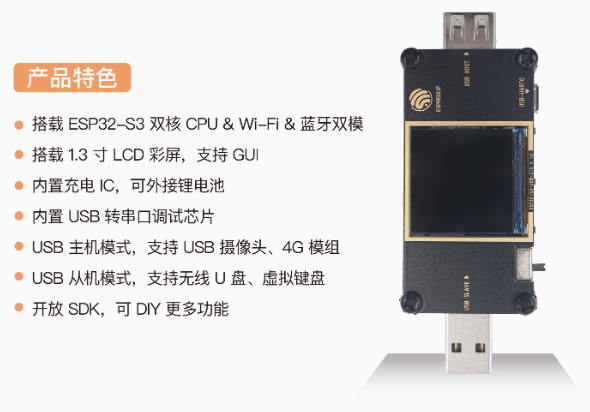

**软件平台**：直接选择[nuttx]([461911662/nuttx: Apache NuttX is a mature, real-time embedded operating system (RTOS)](https://github.com/461911662/nuttx))平台，由于乐鑫有自己的软件平台，对第三方平台也有支持，但是还需要在nuttx适配一下此开发板。


我们选择当下最热的MCU **esp32s3**来搭建boss的软件平台，我们需要学习如下知识：

* xtensa架构ISA手册，[PDF]([cadence.com/content/dam/cadence-www/global/en_US/documents/tools/silicon-solutions/compute-ip/isa-summary.pdf](https://www.cadence.com/content/dam/cadence-www/global/en_US/documents/tools/silicon-solutions/compute-ip/isa-summary.pdf))
* xtensa lx7数据手册，[链接]([Xtensa LX7 Processor Datasheet | Cadence](https://www.cadence.com/en_US/home/resources/product-briefs/xtensa-lx7-processor-pb.html))
* 乐鑫封装MCU，[esp32s3 PDF]([esp32-s3_technical_reference_manual_cn.pdf](https://www.espressif.com.cn/sites/default/files/documentation/esp32-s3_technical_reference_manual_cn.pdf))
* ESP32-S3-USB-OTG原理图，[PDF]([SCH_ESP32-S3_USB_OTG.pdf](https://docs.espressif.com/projects/esp-dev-kits/zh_CN/latest/esp32/_static/esp32-s3-usb-otg/schematics/SCH_ESP32-S3_USB_OTG.pdf))
* nuttx操作系统简单操作


## 快速助记

快速助记主要将高频知识汇总起来提高效率用。

### 快速命令

```bash
# 默认编译烧录
./tools/configure.sh esp32s3-devkit:nsh && make -j12

make clean && make -j12

make flash ESPTOOL_PORT=/dev/ttyACM0 ESPTOOL_BINDIR=./

# 定制编译烧录
make distclean && ./tools/configure.sh -a vendor/boss/app/boss1-app vendor/boss/xtensa/esp32s3/boss1/configs/boss1_zero && make -j4 && ./buildbootloader.sh

rm -f mcuboot-esp32s* && make bootloader ESPSEC_KEYDIR=vendor/boss/xtensa/esp32s3/tools/secure_boot_sign_key

make flash ESPTOOL_PORT=/dev/ttyUSB0 ESPTOOL_BINDIR=./ && ~/.boss/python_env/bin/python3 vendor/boss/tools/scripts/idf-serial.py

# 将usb连接到wls2
usbipd attach --wsl --busid=1-3

# 断开wls2 usb连接
usbipd detach -b 1-3

# wls2打开openocd
sudo /home/liangliang/wk/tools/openocd-esp32/bin/openocd -c 'set ESP_RTOS hwthread; set ESP_FLASH_SIZE 0' -s /home/liangliang/wk/tools/openocd-esp32/share/openocd/scripts -f board/esp32s3-builtin.cfg

# 压缩当前配置
make savedefconfig
```


## 主机环境准备

电脑系统需要Ubuntu或者windows11，其他没做尝试。为了快速，如果没有windows11请安装虚拟机工作在Ubuntu环境中。

### windows11 wls和Linux配置

如下是简要步骤：

* 配置windows wls系统安装包       --- Windows使用

* windows应用商店安装linux（20.04.6 LTS）发行版本      --- Windows使用

* Linux（20.04.6 LTS）系统配置    --- Linux使用

  * 配置镜像源并更新，备份原来的镜像源
  * 配置vscode并安装编码依赖
  * 安装`git`,`make`, `gperf`,`flex`, `bison`, 和 `libncurses-dev`
  * 使用LxRunOffline迁移WSL，链接[Releases · DDoSolitary/LxRunOffline](https://github.com/DDoSolitary/LxRunOffline/releases)

* 安装usbipd，在wls上访问Windows上的usb设备。   --- Windows使用

  * [开源官网]([usbipd-win:Windows software for sharing locally connected USB devices to other machines, including Hyper-V guests and WSL 2. - GitCode](https://gitcode.com/gh_mirrors/us/usbipd-win/overview))

  * cmd中执行`winget install usbipd`命令（关闭wsl2应用）

  * 如下命令来查看usb设备信息

    ```powershell
    usbipd --help
    usbipd list
    usbipd bind --busid=<BUSID> # 绑定此usb设备
    ```

  * 链接设备

    ```powershell
    usbipd attach --wsl --busid=<BUSID>
    ```

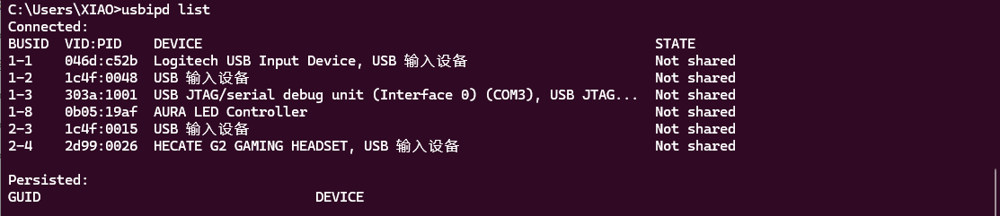

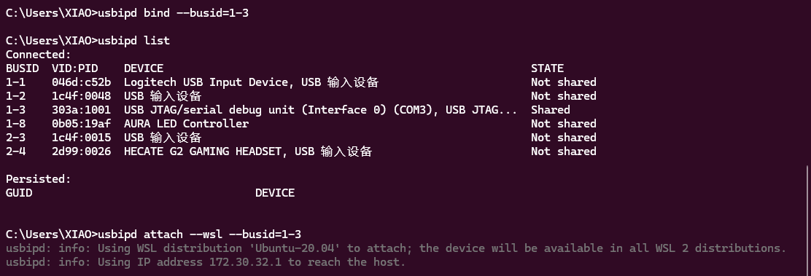

* 卸载usbipd（可选）    --- Windows使用
  * 执行命令`winget uninstall usbipd`

* 安装Linux平台串口驱动     --- Linux使用

  linux平台常用的串口驱动有两个ch340(x)，cp210(x)。一般wsl2 ubuntu 20.04自带都包含了，如下：

  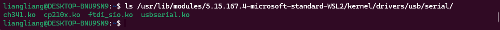

  驱动安装：sudo modprobe vhci-hcd
  

### 没跑走两圈

#### 下载代码

使用git命令下载，仓库地址为：https://github.com/461911662/nuttx.git

```bash
git clone https://github.com/461911662/nuttx.git
cd  nuttx
git checkout boss-dev
git submodule update --init --recursive
# 然后，分别进入子目录，手动将分支切到boss1-dev开发分支
```

#### 环境配置

```bash
# 配置开发环境
./vendor/boss/tools/scripts/command_start.sh -t esp32s3

#手动添加cmake可执行路径到set_env.sh中，cmake在~/.boss/tools/cmake/3.24.0/bin/
source set_env.sh
```

#### 编译

```bash
# 配置zero
make distclean && ./tools/configure.sh -a vendor/boss/app/boss1-app vendor/boss/xtensa/esp32s3/boss1/configs/boss1_zero

# 生成固件
make -j4

# 编译bootloader
rm -f mcuboot-esp32s* && make bootloader ESPSEC_KEYDIR=vendor/boss/xtensa/esp32s3/tools/secure_boot_sign_key
```

#### 烧录

* 使用usbipd进行连接外部usb serial或者usb jtag

  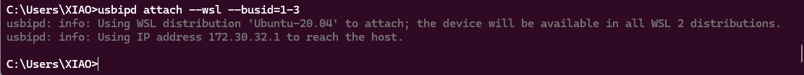

* 烧录

  ```bash
  # 烧录并打开串口
  make flash ESPTOOL_PORT=/dev/ttyUSB0 ESPTOOL_BINDIR=./ && ~/.boss/python_env/bin/python3 vendor/boss/tools/scripts/idf-serial.py
  ```


>  提示：在idf-serial终端中，使用ctrl+T呼出菜单，ctrl+]退出idf-serial终端，然后ctrl+c退出idf-serial程序。


## 编程规范

boss作为一个产品代码，编程规范还是有的。但是仅仅只有如下规范，其他规范不做要求：

### doxygen使用

需要适配`doxygen`，用于懒人生成文档。`doxygen`要求如下：

```
c语言使用/* */包含doxygen关键字，如下关键字：
@file 表示此文件可以被doxygen解析
@brief 表示是一个简要说明
@details 表示是一个详细说明
@note 表示一个需要关注的说明
@attention 表示比note关注更强的说明
@warning 表示比attention关注更强的说明
@return 表示函数的返回值说明
@param 表示函数的形式参数说明
///< 表示单行注释

例子
/**
 * @file example.h
 * @brief 这是一个demo例子
 * @attention 不能用于商业用途，只供学习使用
 */

/**
 * 这是一个在头文件中的demo函数说明
 * @param a 表示用户输入的第一个参数
 * @param b 表示用户输入的第二个参数
 * @return 如果返回非0表示失败，0表示成功
 */
int demo_example(int a, int b);

/**
 * @file example.c
 * @brief 这是一个demo例子
 * @attention 不能用于商业用途，只供学习使用
 */

/**
 * @details 这是一个在C文件中的demo函数说明
 * @note 这个函数必须在系统起来之后调用，否则会crash
 */
int demo_example(int a, int b)
{
  return a+b; ///< 这是一个单行注释，表示a和b的加法返回给用户
}

```


## 基础知识

我们将围绕**xtensa架构ISA手册**、**xtensa lx7数据手册**、**乐鑫封装MCU**、**ESP32-S3-USB-OTG原理图**、**nuttx操作系统简单操作**这几个模块来反复琢磨。如下知识是本人学习笔记，可以适当参考。

### 1、xtensa架构ISA手册

该文档为学习笔记，请适当参考~

参考：[链接]([ESP32 Xtensa(HIFI4/HIFI5) 处理器架构总结-CSDN博客](https://blog.csdn.net/tugouxp/article/details/113816681))

手册提供了快速助记语言，下面是助记语言的约定。

#### 常用标记

---

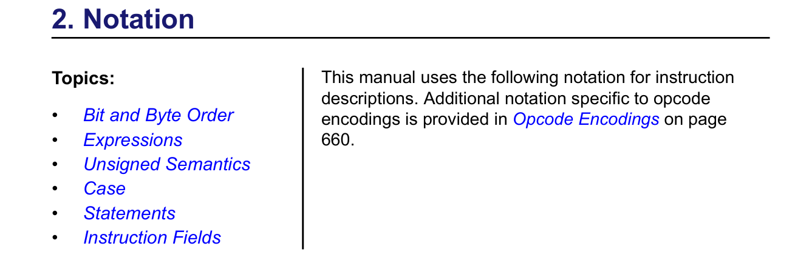

**bit和byte顺序**：

`cpu`的字节序需要配置，默认使用小段字节序。如下分别是32位在大小端情况下的**最高有效位**和**最低有效位**的定义：

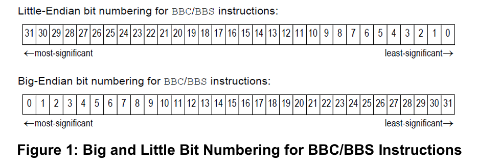

> **运算符**

---------------------

其中规定的符号定义为：v：n‘bit，u：m'bit，t：1'bit

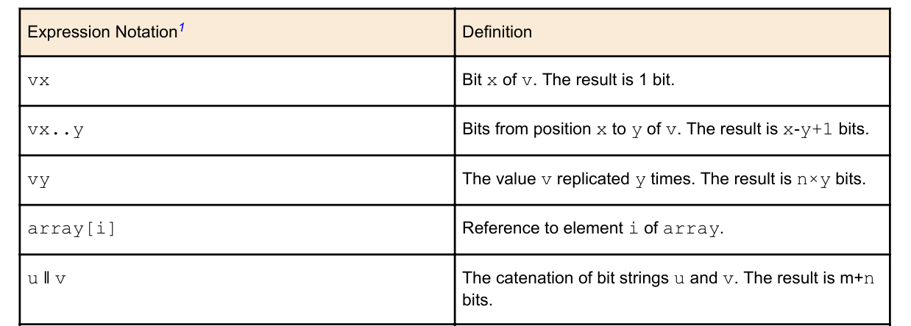

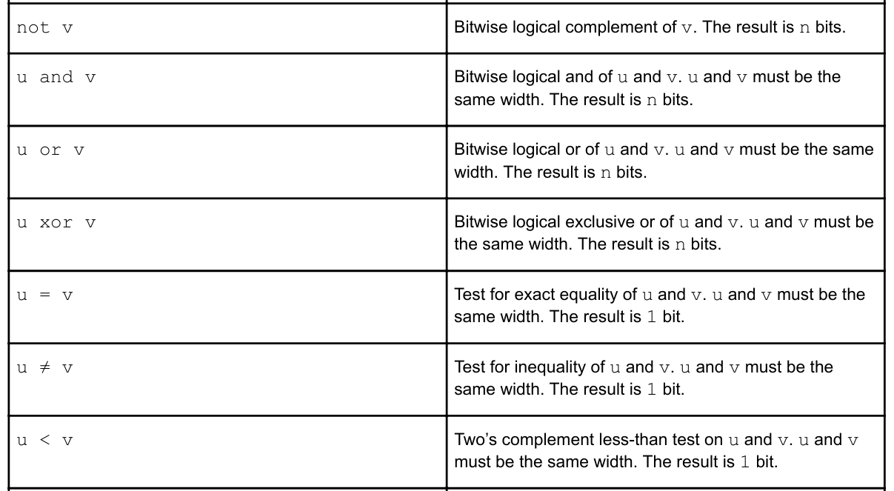


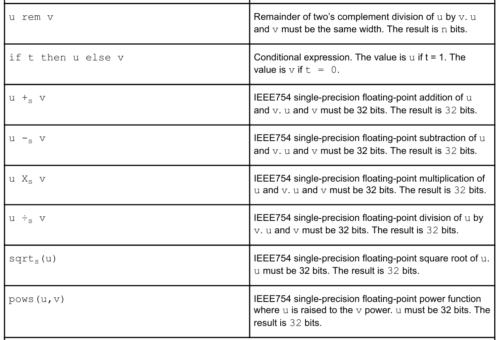

**无符号**：(0 ǁ u)

**变量**：有全局变量和局部变量之分，类似于c语言。

> **语句**

-------------------

**赋值**：`v ← expr`

**条件**：

```text
# 例如：t1等于1时，条件成立，执行s1。
if t1 then
      s1
 [elseif t2 then
      s2]
 .
 .
 .
 [else
      sn]
 endif
```

**跳转**：

```text
label:
goto label
```


#### 指令域说明

---

352个指令，分3天阅读完成。

**underflow**：从子函数退出时，触发underflow。

**overflow**：调用子函数时，窗口溢出，触发overflow。

##### 关键指令助记


> RFWU—Return From Window Underflow

```c++
# 用于从underflow异常中返回
# 恢复之前的窗口基址，并设置窗口切换bit位
# 恢复之前pc，来重复执行之前的retw/retw.n指令
 if CRING ≠  0 then
     Exception (PrivilegedCause)
 else
    PS.EXCM ←  0
    nextPC ←  EPC[1]
    WindowStartWindowBase ←  1
    WindowBase ←  PS.OWB
 endif
```


> RFWO—Return from Window Overflow

```c++
# 用于从overflow异常中返回
# 恢复之前的窗口基址，并清除窗口切换bit位
# 恢复之前pc，来重复执行之前的指令
 if CRING ≠  0 then
     Exception (PrivilegedCause)
 else
    PS.EXCM ←  0
    nextPC ←  EPC[1]
    WindowStartWindowBase ←  0
    WindowBase ←  PS.OWB
 endif
```


> WindowOverflow流程

```c++
# 主要用于保存call[j]的a0-a3寄存器到call[j+1]的堆栈中
# a4-a15保持不动，其中a5是call[j+1]的栈指针
WindowOverflow4:  // inside call[i] referencing a register that
                  // contains data from call[j]
      // On entry here: window rotated to call[j] start point; the
      // registers to be saved are a0-a3; a4-a15 must be preserved
      // a5 is call[j+1]’s stack pointer
      s32e   a0, a5, -16    // save a0 to call[j+1]’s frame
      s32e   a1, a5, -12    // save a1 to call[j+1]’s frame
      s32e   a2, a5,  -8    // save a2 to call[j+1]’s frame
      s32e   a3, a5,  -4    // save a3 to call[j+1]’s frame
      rfwo                  // rotates back to call[i] position
```


> WindowUnderflow流程

```c++
# 主要用于保存call[i+1]的堆栈的参数到call[i]的a0-a3中
 WindowUnderflow4:   // returning from call[i+1] to call[i] where
                    // call[i]’s registers must be reloaded
      // On entry here: a0-a3 are to be reloaded with
      // call[i].reg[0..3] but initially contain garbage.
      // a4-a15 are call[i+1].reg[0..11],
      // (in particular, a5 is call[i+1]’s stack pointer)
      // and must be preserved
      l32e   a0, a5, -16     // restore a0 from call[i+1]’s frame
      l32e   a1, a5, -12     // restore a1 from call[i+1]’s frame
      l32e   a2, a5,  -8     // restore a2 from call[i+1]’s frame
      l32e   a3, a5,  -4     // restore a3 from call[i+1]’s frame
      rfwu
```


> WindowOverflow8 && WindowUnderflow8

```c++
# 如下是callx/callx.n时出现windowoverflow8。retw/retw.n时出现windowoverflow8
# windowoverflow8:
# 1. 当前旋转窗口到call[j](当前执行的函数窗口)
# 2. 保存a0-a3的寄存器到call[j+1]栈的a0-a3
# 3. 保存a4-a8的寄存器到call[j-1]栈的a4-a8
# 4. 退出异常处理
 WindowOverflow8(保存寄存器a0-a8到指定栈):
      // On entry here: window rotated to call[j]; the registers to be
      // saved are a0-a7; a8-a15 must be preserved
      // a9 is call[j+1]’s stack pointer
      s32e   a0, a9, -16   // save a0 to call[j+1]’s frame
      l32e   a0, a1, -12   // a0 <- call[j-1]’s sp
      s32e   a1, a9, -12   // save a1 to call[j+1]’s frame
      s32e   a2, a9,  -8   // save a2 to call[j+1]’s frame
      s32e   a3, a9,  -4   // save a3 to call[j+1]’s frame
      s32e   a4, a0, -32   // save a4 to call[j]’s frame
      s32e   a5, a0, -28   // save a5 to call[j]’s frame
      s32e   a6, a0, -24   // save a6 to call[j]’s frame
      s32e   a7, a0, -20   // save a7 to call[j]’s frame
      rfwo                 // rotates back to call[i] position

# windowunderflow8(从栈中恢复寄存器a0-a8):
# 1. 当前旋转窗口到call[i](当前执行的函数窗口)
# 2. 保存call[i+1]栈的a0-a3到call[i] a0-a3的寄存器
# 3. 保存call[i-1]的a4-a8到call[i] a4-a8的寄存器
# 4. 退出异常处理
 WindowUnderflow8:
      // On entry here: a0-a7 are call[i].reg[0..7] and initially
      // contain garbage, a8-a15 are call[i+1].reg[0..7],
      // (in particular, a9 is call[i+1]’s stack pointer)
      // and must be preserved
      l32e   a0, a9, -16    // restore a0 from call[i+1]’s frame
      l32e   a1, a9, -12    // restore a1 from call[i+1]’s frame
      l32e   a2, a9,  -8    // restore a2 from call[i+1]’s frame
      l32e   a7, a1, -12    // a7 <- call[i-1]’s sp
      l32e   a3, a9,  -4    // restore a3 from call[i+1]’s frame
      l32e   a4, a7, -32    // restore a4 from call[i]’s frame
      l32e   a5, a7, -28    // restore a5 from call[i]’s frame
      l32e   a6, a7, -24    // restore a6 from call[i]’s frame
      l32e   a7, a7, -20    // restore a7 from call[i]’s frame
      rfwu

# WindowOverflow12(保存寄存器a0-a12到指定栈):
# 1. 当前旋转窗口到call[j](当前执行的函数窗口)
# 2. 保存a0-a3的寄存器到call[j+1]栈的a0-a3
# 3. 保存a4-a12的寄存器到call[j-1]栈的a4-a12
# 4. 退出异常处理

# WindowUnderflow12(从栈中恢复寄存器a0-a12):
# 1. 当前旋转窗口到call[i](当前执行的函数窗口)
# 2. 保存call[i+1]栈的a0-a3到call[i] a0-a3的寄存器
# 3. 保存call[i-1]的a4-a12到call[i] a4-a12的寄存器
# 4. 退出异常处理
```


> WindowCheck

```c++
# 此操作在函数调用时会被调用，检查窗口是否已经溢出
procedure WindowCheck (wr, ws, wt)
      n ← if (wr ≠ 2'b00 or ws ≠ 2'b00 or wt ≠ 2'b00)
                  and WindowStartWindowBase+1 then 2’b01     # 01表示使用call4，检查下一个窗口标志位是否被置位，是，则表明窗口溢出了
            else if (wr1 or ws1 or wt1)
                  and WindowStartWindowBase+2 then 2’b10     # 02表示使用call8
            else if (wr = 2'b11 or ws = 2'b11 or wt = 2'b11)
                  and WindowStartWindowBase+3 then 2’b11     # 03表示使用call12
            else 2’b00                                       # 00表示使用call0
      if CWOE = 1 and n ≠ 2’b00 then  # overflow处理
            PS.OWB ← WindowBase
            m ← WindowBase + (2'b00ǁn)
            PS.EXCM ← 1
            EPC[1] ← PC                                      # 此操作在执行完overflow处理后会重新执行当前的指令
            nextPC ← if WindowStartm+1 then WindowOverflow4
                  else if WindowStartm+2 then WindowOverflow8
                  else WindowOverflow12
            WindowBase ← m
      endif
 endprocedure WindowCheck
```


> ENTRY—Subroutine Entry

```c++
# 函数调用第一次指令，首先会检查窗口是否溢出
# 1. 设置被调用者的sp
# 2. 设置窗口基地址
# 3. 设置窗口切换bit位，来切换窗口
 WindowCheck (00, PS.CALLINC, 00)
 elsif as > 3 | PS.WOE = 0 | PS.EXCM = 1 then
    -- undefined operation
    -- may raise illegal instruction exception
 else
    AR[PS.CALLINCǁs1..0] ←  AR[s] −  (017ǁimm12ǁ03)  # 调用者的栈指针 - 被调用者的栈帧 = 被调用者的栈指针
    WindowBase ←  WindowBase +  (02ǁPS.CALLINC)      # 移动窗口基地址
    WindowStartWindowBase ←  1                       # 标志对应的窗口切换bit位
 endif
```


> RETW/RETW.N

```c++
# 从窗口中返回
# 1.正常流程，设置窗口切换bit位为0，切换到caller窗口
# 2.underflow流程，记录异常信息，并切换到caller窗口，再跳转到对应的异样处理流程
 RETW/RETW.N
      n ← AR[0]31..30
      nextPC ← PC31..30 ǁ AR[0]29..0
      owb ← WindowBase
      m ← if WindowStartWindowBase-4’b0001 then 2’b01
       elsif WindowStartWindowBase-4’b0010 then 2’b10
       elsif WindowStartWindowBase-4’b0011 then 2’b11
       else 2’b00
      if n = 2’b00 | (m ≠ 2’b00 & m ≠ n) | PS.WOE=0 | PS.EXCM=1 then
            -- undefined operation
            -- may raise illegal instruction exception
      else
            WindowBase ← WindowBase − (02ǁn)
            if WindowStartWindowBase ≠ 0 then
                  WindowStartowb ← 0
            else
                  -- Underflow exception
                  PS.EXCM ← 1
                  EPC[1] ← PC
                  PS.OWB ← owb
                  nextPC ← if n ← 2'b01 then WindowUnderflow4
                       else if n ← 2'b10 then WindowUnderflow8
                       else WindowUnderflow12
            endif
      endif
```


> RET

```c++
 nextPC ←  AR[0]
```


> CALL0—Non-windowed Call

```c++
# 不会使用窗口调用机制
 AR[0] ←  nextPC
 nextPC ←  (PC31..2 +  (offset1712 ǁoffset) +  1)ǁ00
```


> CALL4—Call PC-relative, Rotate Window by 4

```c++
# 使用窗口机制，首先会检查窗口是否溢出
 WindowCheck (00, 00, 01)
 PS.CALLINC ←  01
 AR[0100] ←  01ǁ(nextPC3)29..0                        # nextPC等于当前指令+3字节，其中0100为callee’s AR[0] = caller’s AR[4]
 nextPC ←  (PC31..2 +  (offset1712ǁoffset) +  1)ǁ00
```


> CALL8—Call PC-relative, Rotate Window by 8

```c++
# 使用窗口机制，首先会检查窗口是否溢出
 WindowCheck (00, 00, 10)
 PS.CALLINC ←  10 if Windowed Register Option
 AR[1000] ←  10ǁ(nextPC)29..0 if Windowed Register Option
 nextPC ←  (PC31..2 +  (offset1712ǁoffset) +  1)ǁ00
```


> CALL12—Call PC-relative, Rotate Window by 12

```c++
# 使用窗口机制，首先会检查窗口是否溢出
 WindowCheck (00, 00, 11)
 PS.CALLINC ←  11
 AR[1100] ←  11ǁ(nextPC)29..0
 nextPC ←  (PC31..2 +  (offset1712ǁoffset) +  1)ǁ00
```


> CALLX0—Non-windowed Call Register

```c++
# 不会使用窗口调用机制
 tmp ←  nextPC
 nextPC ←  AR[s]
 AR[0] ←  tmp
```


> CALLX4—Call Register, Rotate Window by 4

```c++
# 使用窗口机制，首先会检查窗口是否溢出
 WindowCheck (00, 00, 01)
 PS.CALLINC ←  01
 tmp ←  nextPC
 nextPC ←  AR[s]
 AR[01ǁ00] ←  01ǁ(tmp)29..0
```


> CALLX8—Call Register, Rotate Window by 8

```c++
# 使用窗口机制，首先会检查窗口是否溢出
 WindowCheck (00, 00, 10)
 PS.CALLINC ←  10 if Windowed Register Option
 AR[1000] ←  10ǁ(nextPC)29..0 if Windowed Register Option
 nextPC ←  AR[s]
```


> CALLX12—Call Register, Rotate Window by 12

```c++
# 使用窗口机制，首先会检查窗口是否溢出
 WindowCheck (00, 00, 11)
 PS.CALLINC ←  11
 tmp ←  nextPC
 nextPC ←  AR[s]
 AR[11ǁ00] ←  11ǁ(tmp)29..0
```


#### 窗口寄存器学习

---

栈布局：

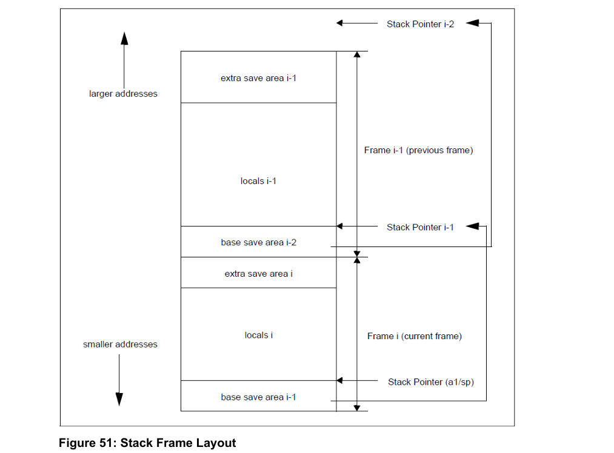

动态栈（只关注n1 bytes位置，其他不用关注）：

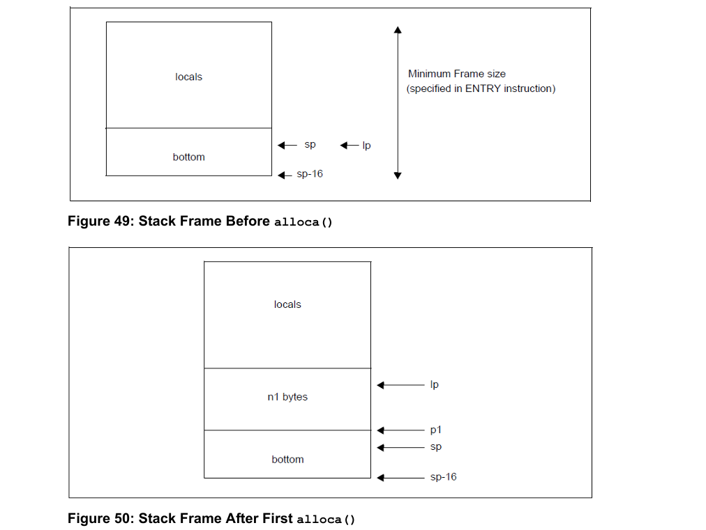

**窗口调用协议**：

* 标签`base save area`定义为16字节，大小固定不变。用来存放当前函数上一个函数的a0-a3（前提上一个函数发生了overflow）。
* 标签`local`一般表示为函数局部变量，大小不定（包括alloca动态扩展的栈大小，一般由编译器扩展）。
* 标签`extra save area`表示扩展寄存器区域，大小不定，一般有0，4，8。用来保存当前函数的a4-a8/a12（前提当前函数发生了overflow）。
* 已知call[i]的sp可以反推出call[i-1]
  * call[i]-12获取到call[i-1]的sp


#### xtensa架构使用

---

> xtensa ISA有两种，窗口寄存器application binary interfaces ABI（也是默认的ABI）和 CALL0 ABI。其中窗口寄存器ABI有两个版本，固定窗口ABI（窗口大小只能为8）和变化窗口ABI（窗口大小可以为4/8/12）。CALL0 ABI只在某些xtensa架构中使用。

**1、窗口ISA**


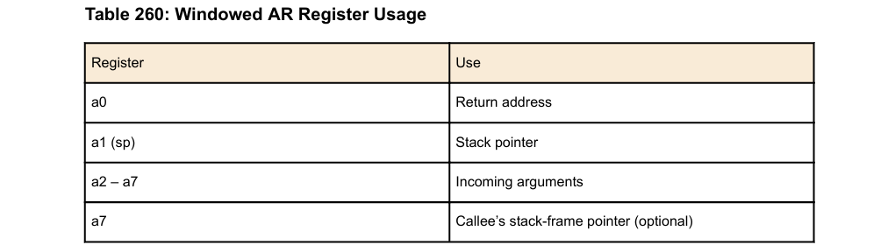

* 除非使能栈帧*宽对齐*，否则栈指针以16字节对齐；
* fp栈帧指针是可选的，在动态栈中，使用alloc时需要栈帧来指定栈帧大小（栈顶fp-栈底sp）。一般在函数entry之后，alloc申请占空间之前，fp等于sp。

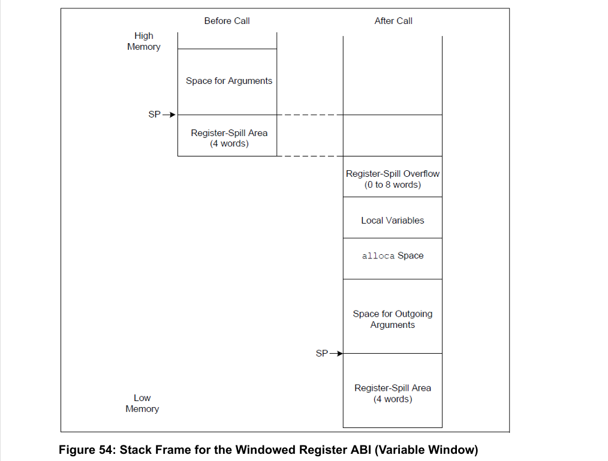

在变化窗口中，有以下说明：

* 标签`register-spill overflow`表示用来存储overflow场景中的剩余寄存器（call4剩余高位寄存器为0，call8剩余高位寄存器为4，call12剩余高位寄存器为8）。所以，`register-spill overflow`的大小一般可选为0，4，8个字（1字=4字节）。
* 标签`register-spill area`是窗口协议定义的字节，在overflow场景触发时用来存放*调用者*的低4位寄存器。
* 标签`Space for Outgoing Arguments`是当前函数调用子函数时，参数不能完全放在窗口寄存器中，剩余参数放在该区域的。

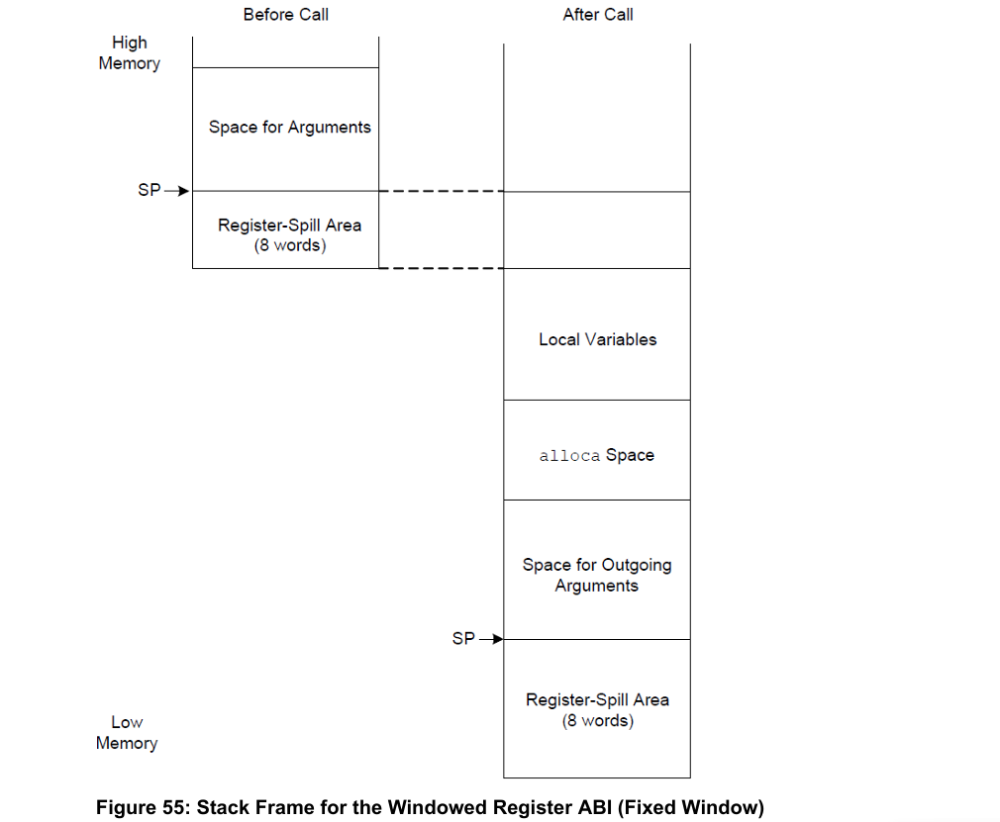

在固定窗口中，有以下说明：

* 标签`register-spill area`有8个用来存放调用者的参数，没有标签`register-spill overflow`。可以看出固定窗口使用call8用于函数调用。

**2、Call0 ISA**

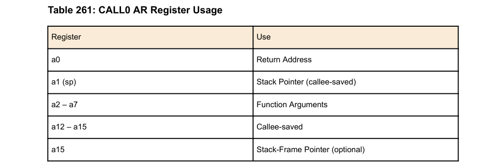

* 没有`register-spill`区域外，其他的栈帧布局与窗口ISA一致。
* 栈指针以16字节对齐。
* 栈帧指针fp保存在a15中。

**3、数据类型对齐**

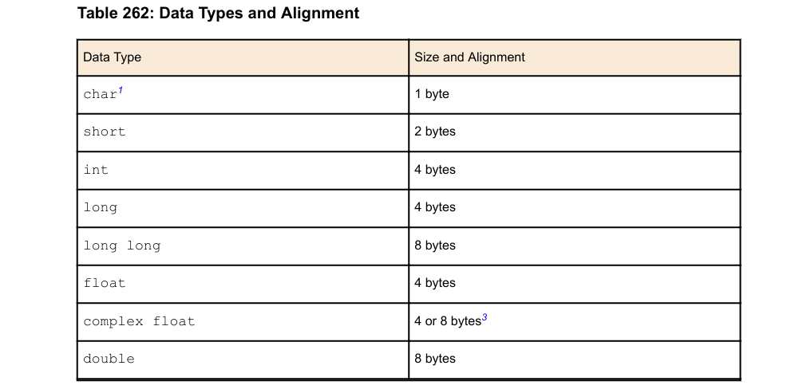

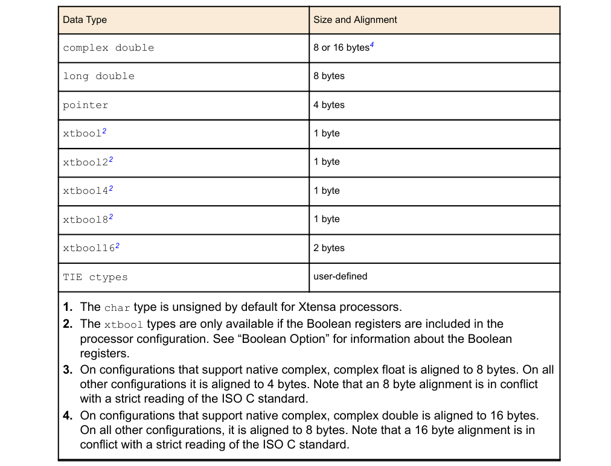

**4、参数传递在通用寄存器**

* 参数小于等于窗口大小时，在call8中调用者传递参数在a[n+2] - a[n+7]中，被调用者使用参数在a[2]-a[7]中。
* 参数大于窗口大小时，剩余参数保存在调用函数栈的`Space for Outgoing Arguments`区域。[sp+0]保存第6个参数，...
* 单个参数大小小于等于4字节时，按照一个字的最小有效位存放。这里区分大小端，另外无符号前面扩展位补0，有符号扩展位补1。
* 单个参数大小大于4字节时，按照字节序存放在一个字中，注意同一个参数不能拆开存放在栈和寄存器中。
* 如果参数没有在寄存器中存放，那么他就可能在栈中存放。这个好像依赖于编译器。
* 参数必须最少4字节对齐，如果该参数寄存器中不能对齐，那么他可能在栈中存放。
* 参数存放在栈中，存放参数的栈内存地址必须对齐。
* 结构体和聚合类型的数据是通过值来存放的，如果寄存器不够用，则保存在连续的栈内。如果寄存器够用，则按顺序存在寄存器中，并在字的最高有效位增加合适的padding。
* 返回值一般保存在a[2]-a[5]中，超过4个字则保存在调用函数分配的内存内。小于一个字，返回值则按最低有效位存放。

**5、浮点类型参数和返回值**

* 配置硬件浮点，它的值可以存放在AR、FP寄存器或者栈中。
* 未配置硬件浮点，它的值可以存放在AR或者栈中。
* 对齐一般有8、16字节对齐方式。
* 如果参数或者返回值存放在寄存器中，那么最开始的参数必须存放在以偶数为编号的寄存器（后面依次顺序存放），否则存放在栈中。

**6、Boolean类型参数和返回值**

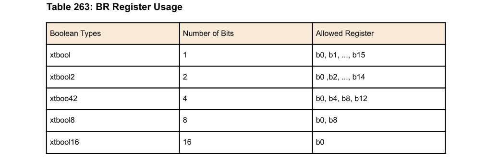

boolean有专门的BR寄存器来传递值。

**7、状态寄存器约定**

描述了某些状态寄存器需要被编译器或者操作系统以及编程人员保存。

**8、栈帧宽对齐**

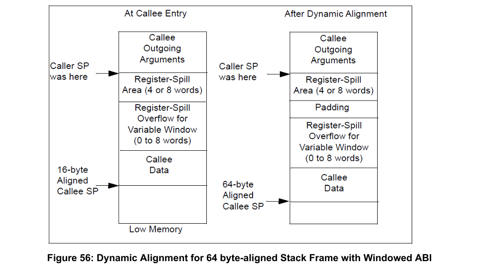

* 栈指针默认16字节对齐，如果函数中有宽对齐参数（64字节），栈指针可以进行64字节对齐。
* PADDING应该放在当前栈帧之上。在`Register-Spill`之下。
* 为了访问存到当前栈的参数，使用SP+FRAME_SIZE+PADDING来获取。

**9、栈初始化**

线程栈初始化：

* 预留一些高位栈内存。
* 初始化栈帧。
* 设置栈指针为栈帧位置。
* 设置返回值为0（寄存器a[0]=0）。

初始化栈帧：

* 对于CALL0、固定窗口CALL8、变化窗口CALL4，可以不初始化。

* 对于变化窗口CALL8、CALL12来讲，需要初始化栈帧。

  * CALL8线程栈，其中`extra save area`和`base save area`都为4个字。

    ```assembly
    // 1、将返回地址设置为0
    // 2、将栈顶减去base save area的值赋给sp
    // 3、a4指向栈顶，32表示两个area总的大小
    // 4、栈指针减去12等于a1的存放地址（在overflow情况下），将栈顶存在a[1]中
    // 5、调用线程函数
    movi    a0, 0
    movi    sp, stackbase + stacksize - 16
    addi    a4, sp, 32       // point 16 past extra save area
    s32e    a4, sp, -12      // access to extra save area
    call8   firstfunction
    ```

  * CALL12线程栈，`extra save area`为8，`base save area`为4个字。

    ```assembly
    // 1、将返回地址设置为0
    // 2、将栈顶减去base save area-本地变量的值赋给sp
    // 3、a4指向栈顶，48表示两个area总的大小
    // 4、栈指针减去12等于a1的存放地址（在overflow情况下），将栈顶存在a[1]中
    // 5、调用线程函数
    movi     a0, 0
    movi     sp, stackbase + stacksize - loc - 32
    addi     a4, sp, loc + 48  // point 16 past extra save area
    s32e     a4, sp, -12       // access to extra save area
    call12   firstfunction
    ```

**10、其他约定**

* break指令（略）。
* 在系统调用中，系统调用号保存在A2中。call0和固定窗口不需要实现系统调用号0，变化窗口需要实现。它的作用时将寄存器窗口存到栈中。
* 汇编代码（略）。


**函数调用流程**：

* 调用CALLn/CALLnX指令。

* 调用ENTRY指令。

函数返回流程：

* 调用RETW/RETW.N指令。


#### xtensa 异常学习

---

异常分为两个组：

* 静态组
  * ResetVector
  * MemoryErrorVector
* 动态组
  * WindowOverflow4
  * WindowUnderflow4
  * WindowOverflow8
  * WindowUnderflow8
  * WindowOverflow12
  * WindowUnderflow12
  * InterruptVector[2]
  * InterruptVector[3]
  * InterruptVector[4]
  * InterruptVector[5]
  * InterruptVector[6]
  * InterruptVector[7]
  * KernelExceptionVector
  * UserExceptionVector
  * DoubleExceptionVector


esp32s3中断向量表：


**异常语义**：

```c++
procedure Exception(cause)
      if (PS.EXCM & NDEPC=1) then
            DEPC ← PC
            nextPC ← DoubleExceptionVector
      elseif PS.EXCM then
            EPC[1] ← PC
            nextPC ← DoubleExceptionVector
      elseif PS.UM then
            EPC[1] ← PC
            nextPC ← UserExceptionVector
      else
            EPC[1] ← PC
            nextPC ← KernelExceptionVector
      endif
      EXCCAUSE ← cause
      PS.EXCM ← 1
 endprocedure Exception
```

> 说明：
>
> 1、静态异常组有两个异常基地址。如果ExternalResetVector为false时，默认使用默认基地址，如果为true，使用默认基地址，也可以在reset时通过外部引脚选择备用基地址。
>
> 2、动态异常组的基地址配置是使用VECBASE寄存器的。


**中断**

优先级1中断：优先级最低，使用统一的`PS.INTLEVEL`、`INTENABLE`、`INTERRUPT`寄存器来处理中断。

高优先级中端：比中断优先级1高，通常可以为中断配置2-6的优先等级。每一个优先级等级中有各自的寄存器来处理，处理周期短，但是耗费寄存器多。


### 2、xtensa lx7数据手册

~

### 3、乐鑫封装MCU esp32s3

需要清楚乐鑫封装和esp32s3的知识。

### 4、ESP32-S3-USB-OTG原理图

需要会看原理图

### 5、nuttx操作系统简单操作

本文档来自nuttx官方文档`Documentation/legacy_README.md`。


#### 1、配置`Nuttx`

配置文件目录结构：

```c
boards/<arch-name>/<chip-name>/<board-name>/configs/<config-dir>
```

`<arch-name>`是描述芯片架构的目录。

`chip-name`是描述芯片型号的目录。

`board-name`是描述开发板名字的目录。

`config-dir`是描述开发板指定功能配置的目录。

Windows使用如下命令来配置：

```c
tools\configure.bat <board-name>:<config-dir>
// 脚本使用的程序：
{TOPDIR}/tools/configure.c
```

Linux使用如下命令来配置：

```c
tools/configure.sh <board-name>:<config-dir>
```

可能的文档存在目录：

```c
{TOPDIR}/boards/README.txt
{TOPDIR}/boards/<arch-name>/<chip-name>/<board-name>/README.txt
```

配置脚本的原理：

* 复制文件

  * 复制 `boards/<arch-name>/<chip-name>/<board-name>/configs/<config-dir>/Make.def` 或者 `boards/<arch-name>/<chip-name>/<board-name>/scripts/Make.def` 到 `{TOPDIR}/Make.defs`。其中匹配顺序为`<config-dir>/Make.def`，然后是`scripts/Make.def`。

    `Make.defs`是用于定义编译和链接规则的。

  * 复制 `boards/<arch-name>/<chip-name>/<board-name>/configs/<config-dir>/defconfig` 到 `{TOPDIR}/.config|defconfig`。

    `defconfig`文件定义了构建系统的配置，并用于生成配置头文件（通常位于`include/nuttx/config.h`），这些配置信息在编译过程中被引用。

  * 复制其他文件到`{TOPDIR}`，比如`.gdbinit`等配置文件。

* 刷新配置

  * 当配置发生变化时，`NuttX`需要刷新配置，这包括解压缩`defconfig`文件并重新生成Makefile，以确保构建系统使用最新的配置信息。`make olddefconfig`


#### 2、刷新`Nuttx`配置

一般有两种方式：

* 使用`make oldconfig`来刷新，他会根据根目录`.config`和`Kconfig`文件来生成最新的配置(会主动询问)。
* 使用`make olddefconfig`来刷新，他会根据根目录`defconfig`和`Kconfig`文件来生成最新的配置(不会询问，使用默认值)。


#### 3、配置`Nuttx`工具

这是一个自动化配置工具。这个工具来源于此应用`[kconfig-frontends](https://bitbucket.org/nuttx/tools/src/master/kconfig-frontends/)`，其中顶层`Makefile`通过目标`menuconfig`调用此工具（`kconfig-mconf`）来做配置。


一般在调用`kconfig-mconf`之前需要做如下工作：

* `NuttX`的每个目录中几乎都会有一个`Kconfig`配置文件，这些文件包含了与所在目录相关的配置设置信息。
* `kconfig-mconf`是`kconfig-frontends`包的一部分，你可以从`NuttX`的[tools](https://bitbucket.org/nuttx/tools)仓库下载这个包。


基本的配置顺序：

* 选择构建环境；

* 选择处理器；

* 选择板卡；

* 选择支持的外设；

* 配置设备驱动程序；

* 在顶层配置应用程序选项；

> 其他工具：
>
> 1、使用ncurses-based可以让你生成kconfig-nconf；
>
> 2、使用QT图形库可以让你生成kconfig-qconf；
>
> 3、使用GTK图形库可以让你生成kconfig-gconf；


当你运行`make menuconfig`命令时，会启动kconfig-mconf工具。这个工具支持一些键盘快捷键，以下是这些快捷键的功能解释：

- `?`：会显示mconfig的帮助信息。
- `/`：可以用于查找配置选项。
- `Z`：可以用于显示隐藏的配置选项


#### 4、操作配置文件

> 4.1、配置文件比较

你可以使用如下命令生成`cmpconfig`工具，用来比较有差异的`defconfig`和`.config`

```bash
cd nuttx/tools
make -f Makefile.host
```


> 4.2、配置文件压缩

一般使用命令来压缩根目录下的`.config`文件：

```bash
make savedefconfig
```

比较`.config`和`defconfig`文件情况：

```bash
wc -l .config defconfig
 1085 .config
   82 defconfig
 1167 total
```


> 4.3、配置文件解压

为了让配置文件有效（增加回原来的默认项），就需要利用`.config`和`Kconfig`对压缩配置文件`defconfig`进行解压。

```bash
make olddefconfig
```


另外，`make oldconfig`是根据解压后的`.config`生成最新的`.config`，在生成过程中需要用户确认默认项。如下：

```bash
Use components that have BSD licenses (ALLOW_BSD_COMPONENTS) [N/y/?] (NEW) y   
Use components that have GPL/LGPL licenses (ALLOW_GPL_COMPONENTS) [N/y/?] (NEW) n
```


#### 5、配置交叉工具

**交叉编译器**，用于为目标CPU生成代码。配置说明在`boards/<arch-name>/<chip-name>/<board-name>/`目录下的`README.txt`文件。

`NuttX`的`[Bitbucket.org](https://bitbucket.org/nuttx/buildroot/src/master/)`文件仓库提供了`DIY`工具，同时需要检查开发板的`README.txt`是否支持。


可以显示的声明工具链前缀:

```bash
make CROSSDEV=arm-nuttx-elf
```


#### 6、编译`Nuttx`

> 1、编译

```bash
cd {TOPDIR}
make
```


> 2、重新编译

由于Windows系统不支持软连接，需要拷贝文件来进行正常工作。所以在重新编译之前，需要执行：

```bash
make clean_context all
```

这个make命令会会将拷贝的文件删除，然后重新拷贝。


如下文件被移除后会重新创建：

```bash
include/nuttx/config.h
arch/arm/src/chip
arch/arm/src/board
```


> 3、编译目标

`nuttx`系统：

```bash
all：这是默认目标，用于构建NuttX可执行文件；
clean：移除派生对象文件、归档文件、可执行文件和临时文件，但会保留配置和上下文文件和目录。
distclean：此目标会先执行clean操作，然后还会移除所有配置和上下文文件，从而将目录结构恢复到其原始、未配置的状态。
```

```bash
apps_clean：此目标仅在用户应用程序目录中执行清理操作，移除该目录中派生对象文件、可执行文件和临时文件等，但会保留配置和上下文文件。
apps_distclean：此目标仅在用户应用程序目录中执行完全清理操作，移除所有配置和上下文文件，但会保留apps/.config文件，以便将该应用程序目录的配置重置为初始状态。
export：此目标将NuttX库和头文件打包为可导出的包。但请注意，这需要一些针对KERNEL构建的扩展，并且tools/mkexport.sh脚本中的逻辑仅支持GCC，并明确假设归档器是'ar'。
flash：此辅助目标将重建NuttX并将其闪存到目标系统，这是一步完成的操作。该目标的操作完全取决于用户Make.defs文件中FLASH命令的实现。
```


`nuttx-apps`：

```bash
depend：此目标用于创建构建依赖项。
context：在每个目标构建过程中都会调用此目标，以确保NuttX已正确配置。基本的配置步骤包括在include/nuttx目录中创建config.h和version.h头文件，并建立到配置目录的符号链接。
clean_context：此目标是distclean目标的一部分，用于移除所有由context目标创建的头文件和符号链接。
```


> 4、编译选项

* `V=1` 构建时，打印更多信息。


#### 7、文档

`nuttx`系统的学习文档在`${TOPDIR}/Documentation/index.rst`。

